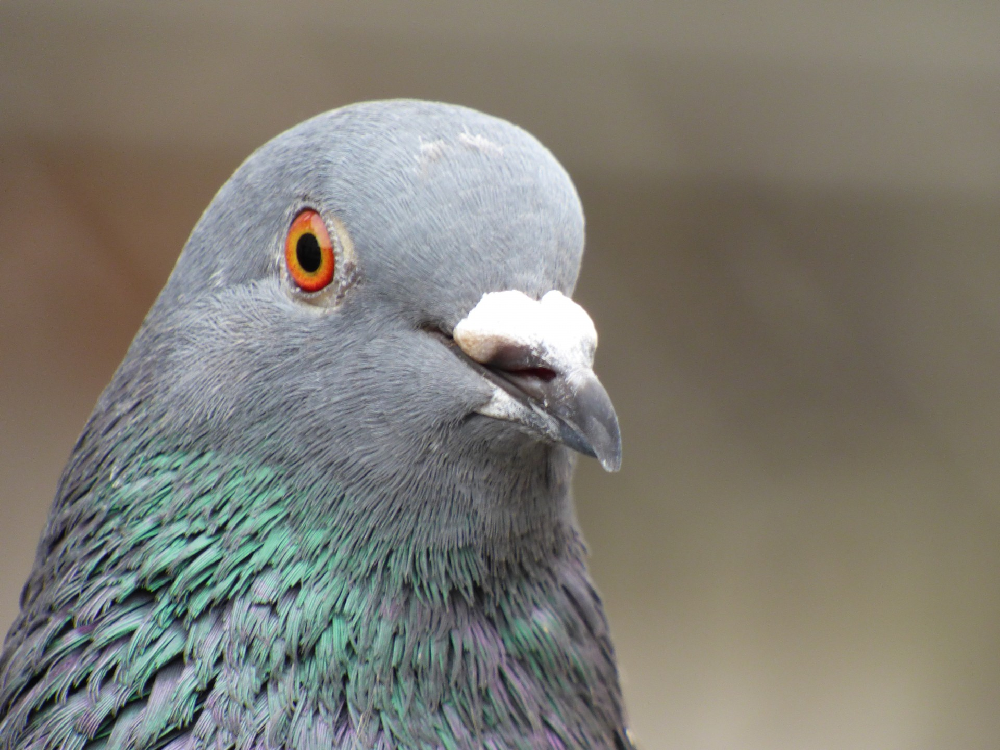

# TAPL-Practice

<!-- <figure> -->
  <!-- 
  <!-- src="./img/pigeon.jpg" -->
  <!-- alt="silly pigeon"> -->
  <!-- <figcaption><i>self image</i></figcaption> -->
<!-- </figure> -->

### TODO
- [x] UTLC
  - [x] Semantics
    - [x] Small-step
    - [x] Big-step
  - [x] Evaluation Strategy
    - [x] Call-By-Value
    - [x] Call-By-Name
    - [x] Lazy Evaluation
- [x] STLC
- [ ] Subtyping
- [ ] Recursive Types
- [ ] Polymorphism
- [ ] Higher-Order Systems
- [ ] Create a new toy language with all these features
- [ ] **Important** Prove all the theorems in Coq

*make slow progress...*
